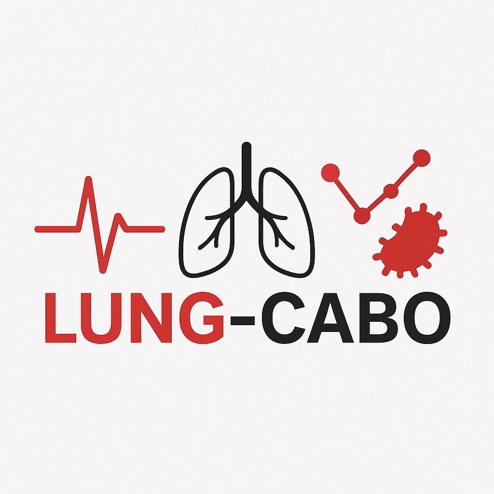

# Lung-CABO Ontology

## Purpose and Scope

The **Lung-CABO ontology** is designed to semantically represent and integrate curated biological knowledge related to **lung cancer**. It brings together multi-source data to describe genes, variants, chromosomal abnormalities, gene fusions, biological pathways, and their relationships to specific lung cancer subtypes.

The scope of Lung-CABO includes:
- **Biomedical concepts**: Gene, variant, chromosomal abnormality, gene fusion, pathway, organism, protein, disease subtype.
- **Associations between concepts**: Gene-disease associations, chromosomal location, functional consequences, pathway memberships, and others.

## Vocabulary Development

This ontology has been developed following the guidelines of the [LOT methodology](https://lot.linkeddata.es/), which promotes reuse, modularity, and publication following Linked Data principles.

## Requirements

The ontology requirements were derived from the domain needs of integrating and querying multi-source biological information in the context of lung cancer. These requirements are validated through **Competency Questions** that test the ability of the ontology to answer relevant biomedical queries.

The requirements are available [here](Requirements/Requirements-LungCABO.xlsx), and can also be visualized in HTML format [here](https://deliaamintamoreno.github.io/LungCABO-Resources/Requirements/requirements-LungCABO.html).

## Ontology Model

The Lung-CABO ontology model provides an overview of the core **Classes**, **Data Properties**, and **Object Properties**, designed using [Chowlk notation](https://chowlk.linkeddata.es/).

- Full ontology diagram:  
  
- You can explore individual diagrams [here](diagrams/).

## Ontology (OWL)

The OWL-encoded version of the ontology can be found [here](Lung-CABO%20Documentation/ontology.owl).

## Documentation

The Lung-CABO ontology documentation was generated using [WIDOCO](https://github.com/oeg-upm/Widoco).

The complete documentation is available [here](Lung-CABO%20Documentation/index-en.html), and includes:
- **Provenance**: Metadata on the creation and evolution of the ontology.
- **Resources**: Lists of reused vocabularies and instances.
- **Multiple formats**: RDF/XML, Turtle, JSON-LD.

## Contribute

You can contribute by reporting issues or suggesting improvements via the [Issues](https://github.com/deliaamintamoreno/LungCABO-Resources/issues) tab of this repository.  
If you would like to collaborate on future versions or extensions of Lung-CABO, feel free to contact the authors.

## Authors

- Delia Aminta Moreno Perdomo
- Paloma Tejera Nevado
- Lucía Prieto Santamaría
- Guillermo Vigueras
- Antonio Díaz
- Alejandro Rodríguez González

**MEDAL - LUCIA Project**
