# SPARQL queries for Lung-CABO-KG competency questions

Here we include the 13 SPARQL queries for each of the competency questions designed to validate for Lung-CABO.


## Lung-CABO1
 Can we identify patterns of gene fusions that are shared across different types of pathologies?
 ```Sparql
PREFIX rdf: <http://www.w3.org/1999/02/22-rdf-syntax-ns#>
PREFIX ncit: <http://ncicb.nci.nih.gov/xml/owl/EVS/Thesaurus.owl#>
PREFIX sio: <http://semanticscience.org/resource/>
PREFIX bao: <http://www.bioassayontology.org/bao#>
PREFIX dcterms: <http://purl.org/dc/terms/>
PREFIX rdfs: <http://www.w3.org/2000/01/rdf-schema#>
PREFIX mesh: <http://phenomebrowser.net/ontologies/mesh/mesh.owl#>

SELECT ?geneFusionLabel 
       (GROUP_CONCAT(DISTINCT ?diseaseLabel; SEPARATOR=", ") AS ?associatedDiseases)
WHERE {
  # Gene-Disease Association
  ?gda sio:SIO_000628 ?gene, ?disease ;
       dcterms:identifier ?gdaId .

  # Disease information
  ?disease rdf:type ncit:C7057 ;
           dcterms:identifier ?diseaseId ;
           rdfs:label ?diseaseLabel ;
           bao:BAO_0090007 ?organismIRI .

  # Organism information
  ?organismIRI rdf:type ncit:C14250 ;
               dcterms:identifier ?organismId ;
               rdfs:label ?organismLabel .

  # Gene fusion path: GDA → biomarker → gene alteration → gene fusion
  ?biomarker rdfs:subClassOf ?gda .
  ?geneAlteration rdfs:subClassOf ?biomarker ;
                  sio:SIO_000008 ?geneFusion .

  # Gene Fusion entity
  ?geneFusion rdf:type sio:SIO_001348 ;
              dcterms:identifier ?geneFusionId ;
              rdfs:label ?geneFusionLabel .
}
GROUP BY ?geneFusionLabel
HAVING (COUNT(DISTINCT ?diseaseLabel) > 1)

 ```
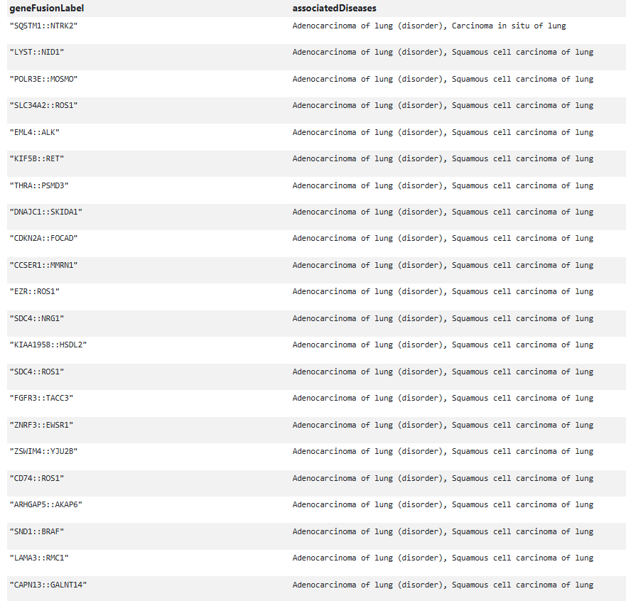
*Figure 1: Example gene fusions associated with more than one lung cancer subtype (partial view of results).*


## Lung-CABO2
What level of confidence is there in the genes described in lung cancer?
```Sparql
PREFIX rdf: <http://www.w3.org/1999/02/22-rdf-syntax-ns#>
PREFIX ncit: <http://ncicb.nci.nih.gov/xml/owl/EVS/Thesaurus.owl#>
PREFIX sio: <http://semanticscience.org/resource/>
PREFIX bao: <http://www.bioassayontology.org/bao#>
PREFIX dcterms: <http://purl.org/dc/terms/>
PREFIX rdfs: <http://www.w3.org/2000/01/rdf-schema#>
PREFIX mesh: <http://phenomebrowser.net/ontologies/mesh/mesh.owl#>

SELECT DISTINCT 
  ?zscore
  ?geneID 
  ?gene_name 
  ?gene_symbol 
  ?disease_id 
  ?disease_name 
WHERE {
  # Gene-disease association
  ?gda a sio:SIO_000983 ;                          # Gene-Disease Association class
       sio:SIO_000628 ?gene, ?disease ;            # Connects to gene and disease
       sio:SIO_000216 ?zscoreIRI ;                 # Connects to Z-score resource
       dcterms:identifier ?gda_id .

  # Z-score value
  ?zscoreIRI a ncit:68741 ;                        # Z-score class
             sio:SIO_000300 ?zscore .

  # Gene information
  ?gene a ncit:C16612 ;                            # Gene class
        dcterms:identifier ?geneID ;
        rdfs:label ?gene_name ;
        sio:SIO_010078 ?proteinIRI ;               # Encodes a protein
        sio:SIO_000205 ?geneSymbolIRI .            # Has gene symbol

  # Gene symbol
  ?geneSymbolIRI a ncit:C43568 ;
                 dcterms:identifier ?gene_symbol .

  # Disease information
  ?disease rdf:type ncit:C7057 ;
           dcterms:identifier ?disease_id ;
           rdfs:label ?disease_name ;
           bao:BAO_0090007 ?organismIRI .

}

```
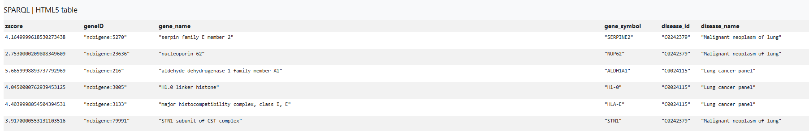
*Figure 2: Confidence levels of genes associated with lung cancer based on Z-score evidence (partial view of results).*
## Lung-CABO3
Can we determine the chromosomal positions of the gene variants described in lung cancer?
```Sparql
PREFIX rdf: <http://www.w3.org/1999/02/22-rdf-syntax-ns#>
PREFIX ncit: <http://ncicb.nci.nih.gov/xml/owl/EVS/Thesaurus.owl#>
PREFIX sio: <http://semanticscience.org/resource/>
PREFIX bao: <http://www.bioassayontology.org/bao#>
PREFIX dcterms: <http://purl.org/dc/terms/>
PREFIX rdfs: <http://www.w3.org/2000/01/rdf-schema#>
PREFIX CABO: <https://w3id.org/LUCIA/sem-lucia#>
PREFIX mesh: <http://phenomebrowser.net/ontologies/mesh/mesh.owl#>
PREFIX OBO: <http://purl.obolibrary.org/obo/>
PREFIX geno: <http://purl.obolibrary.org/obo/>

SELECT DISTINCT
  ?variant_id
  ?dbsnp_id
  ?gene_id
  ?gene_name
  ?gene_symbol
  ?chromosome
  ?chromosome_start_position
  ?chromosome_end_position
  ?reference_allele
  ?alternative_allele
WHERE {
  # Variant entity
  ?variant a OBO:SO_0001060 ;                     # Sequence variant
           sio:SIO_001403 ?gene ;                 # Variant affects gene
           dcterms:identifier ?variant_id ;
           LUCIA:consequence ?consequence .

  OPTIONAL {
    ?variant sio:SIO_000223 ?alternative_allele_iri, ?reference_allele_iri .
    ?reference_allele_iri a geno:GENO_0000152 ;
                          sio:SIO_000300 ?reference_allele .
    ?alternative_allele_iri a geno:GENO_0000476 ;
                            sio:SIO_000300 ?alternative_allele .
  }

  OPTIONAL {
    ?variant CABO:dbsnp_id ?dbsnp_id .
  }

  # Chromosomal location
  ?variant sio:SIO_000061 ?chromosome_iri,
                           ?start_position_iri,
                           ?end_position_iri .

  ?chromosome_iri a sio:SIO_000899 ;
                  sio:SIO_000300 ?chromosome .

  ?start_position_iri a sio:SIO_000791 ;
                      sio:SIO_000300 ?chromosome_start_position .

  ?end_position_iri a sio:SIO_000792 ;
                    sio:SIO_000300 ?chromosome_end_position .

  # Gene info
  ?gene a ncit:C16612 ;
        dcterms:identifier ?gene_id ;
        rdfs:label ?gene_name ;
        sio:SIO_000205 ?gene_symbol_iri .

  # Gene symbol
  ?gene_symbol_iri a ncit:C43568 ;
                   dcterms:identifier ?gene_symbol .
}
```
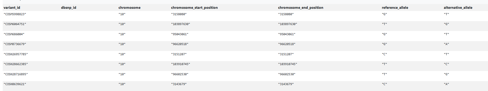
*Figure 3: Example gene fusions associated with more than one lung cancer subtype (partial view of results).*
## Lung-CABO4
Of the genes involved in Non-small cell lung cancer and small cell lung cancer, what pathways do they share?
```Sparql
```
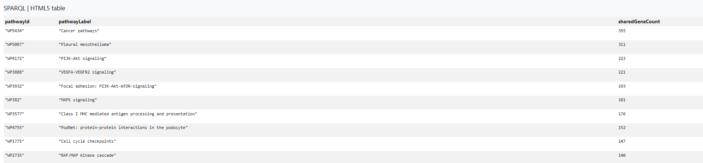
*Figure 4: Example gene fusions associated with more than one lung cancer subtype (partial view of results).*
## Lung-CABO5
Which object property defines the relationship between a variant and a disease?
```Sparql
PREFIX rdf: <http://www.w3.org/1999/02/22-rdf-syntax-ns#>
PREFIX ncit: <http://ncicb.nci.nih.gov/xml/owl/EVS/Thesaurus.owl#>
PREFIX sio: <http://semanticscience.org/resource/>
PREFIX bao: <http://www.bioassayontology.org/bao#>
PREFIX dcterms: <http://purl.org/dc/terms/>
PREFIX rdfs: <http://www.w3.org/2000/01/rdf-schema#>
PREFIX mesh: <http://phenomebrowser.net/ontologies/mesh/mesh.owl#>
PREFIX OBO: <http://purl.obolibrary.org/obo/>
 
SELECT DISTINCT ?association_type
WHERE {
  ?assoc a ?association_type ;
         sio:SIO_000628 ?variant ;
         sio:SIO_000628 ?disease .
  ?variant a OBO:SO_0001060 .
  ?disease a ncit:C7057 .
}
```

*Figure 5: Example gene fusions associated with more than one lung cancer subtype (partial view of results).*
## Lung-CABO6
Which semantic type is used to classify a disease in Lung-CABO?
```Sparql
Q7: PREFIX rdf: <http://www.w3.org/1999/02/22-rdf-syntax-ns#>
PREFIX ncit: <http://ncicb.nci.nih.gov/xml/owl/EVS/Thesaurus.owl#>
PREFIX sio: <http://semanticscience.org/resource/>
PREFIX bao: <http://www.bioassayontology.org/bao#>
PREFIX dcterms: <http://purl.org/dc/terms/>
PREFIX rdfs: <http://www.w3.org/2000/01/rdf-schema#>
PREFIX mesh: <http://phenomebrowser.net/ontologies/mesh/mesh.owl#>
PREFIX OBO: <http://purl.obolibrary.org/obo/>
 
SELECT distinct ?disease ?semanticType 
WHERE {
  ?disease a ncit:C7057 ;
          sio:SIO_000008 ?semanticTypeIRI .
?semanticTypeIRI a ncit:C43817;
rdfs:label ?semanticType.
}
```
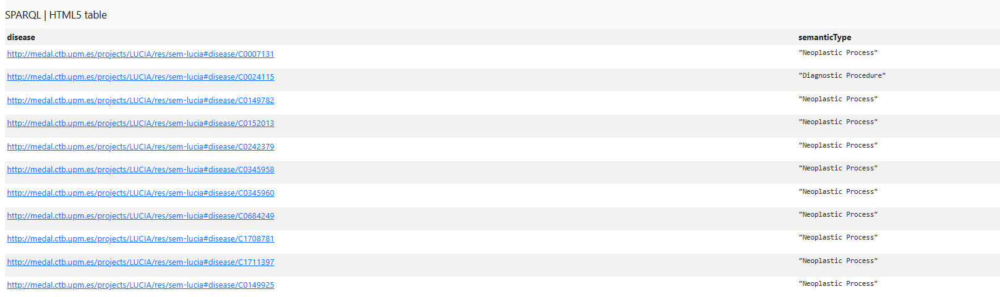
*Figure 6: Example gene fusions associated with more than one lung cancer subtype (partial view of results).*
## Lung-CABO7
How many pathways are associated with a specific lung cancer subtype (Small Cell Lung Cancer)  throught the asociated genes?
```Sparql
PREFIX rdf:    <http://www.w3.org/1999/02/22-rdf-syntax-ns#>
PREFIX ncit:   <http://ncicb.nci.nih.gov/xml/owl/EVS/Thesaurus.owl#>
PREFIX sio:    <http://semanticscience.org/resource/>
PREFIX bao:    <http://www.bioassayontology.org/bao#>
PREFIX dcterms:<http://purl.org/dc/terms/>
PREFIX rdfs:   <http://www.w3.org/2000/01/rdf-schema#>
PREFIX CABO:  <https://w3id.org/LUCIA/sem-lucia#>
PREFIX mesh:   <http://phenomebrowser.net/ontologies/mesh/mesh.owl#>

SELECT (COUNT(DISTINCT ?pathwayId) AS ?pathwayCount)
WHERE {
  # Gene–disease association
  ?gda a sio:SIO_000983 ;
       sio:SIO_000628 ?gene, ?disease ;
       dcterms:identifier ?gdaId .

  # Gene information
  ?gene a ncit:C16612 ;
        dcterms:identifier ?geneId ;
        rdfs:label ?geneLabel ;
        sio:SIO_000068 ?pathway ;
        sio:SIO_000205 ?geneSymbolIRI .

  # Pathway information
  ?pathway a CABO:Pathway ;
           dcterms:identifier ?pathwayId ;
           rdfs:label ?pathwayLabel .

  # Disease information (Small cell lung cancer)
  ?disease a ncit:C7057 ;
           dcterms:identifier ?diseaseCUI ;
           rdfs:label ?diseaseLabel ;
           bao:BAO_0090007 ?organismIRI .

  FILTER(?diseaseCUI = "C0149925")
}


```
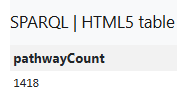
*Figure 7: Example gene fusions associated with more than one lung cancer subtype (partial view of results).*
## Lung-CABO8
What is the parent class and external alignment of a given disease in Lung-CABO?
```Sparql
PREFIX obo:   <http://purl.obolibrary.org/obo/>
PREFIX rdfs:  <http://www.w3.org/2000/01/rdf-schema#>
PREFIX dcterms: <http://purl.org/dc/terms/>
PREFIX skos:  <http://www.w3.org/2004/02/skos/core#>

SELECT ?diseaseId ?diseaseLabel ?parentClass ?parentLabel ?parentId 
WHERE {
  # Disease instance 
  <http://medal.ctb.upm.es/projects/LUCIA/res/sem-lucia#disease/C0149782> 
    rdfs:type ?type ;
    dcterms:identifier ?diseaseId ;
    rdfs:label ?diseaseLabel .

  # Retrieve parent class of the disease type
  ?type rdfs:subClassOf ?parentClass .
  ?parentClass rdfs:label ?parentLabel ;
               dcterms:identifier ?parentId .
}

```
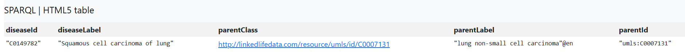
*Figure 8: Example gene fusions associated with more than one lung cancer subtype (partial view of results).*
## Lung-CABO9
Which genes do not have an associated DPI?
```Sparql
PREFIX obo:   <http://purl.obolibrary.org/obo/>
PREFIX rdfs:  <http://www.w3.org/2000/01/rdf-schema#>
PREFIX dcterms: <http://purl.org/dc/terms/>
PREFIX ncit:  <http://ncicb.nci.nih.gov/xml/owl/EVS/Thesaurus.owl#>
PREFIX sio:   <http://semanticscience.org/resource/>

SELECT DISTINCT ?geneLabel
WHERE {
  # Select all genes with their labels
  ?gene a ncit:C16612 ;
        rdfs:label ?geneLabel .

  # Optional DPI association
  OPTIONAL {
    ?gene sio:SIO_000216 ?dpi .
    ?dpi a sio:SIO_001352 .
  }
}
GROUP BY ?gene ?geneLabel
HAVING (COUNT(?dpi) = 0)

```
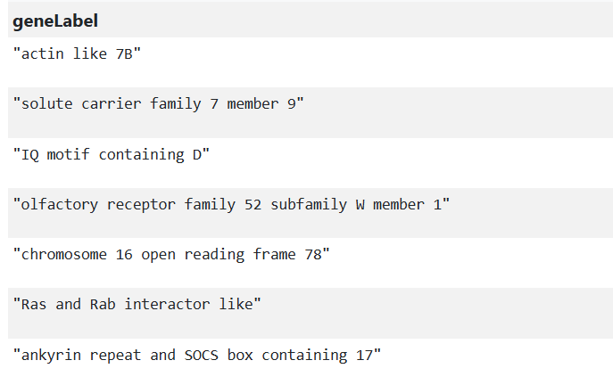
*Figure 9: Example gene fusions associated with more than one lung cancer subtype (partial view of results).*
## Lung-CABO10
Can a given gene be associated with more than two variant?
```Sparql
PREFIX rdf:    <http://www.w3.org/1999/02/22-rdf-syntax-ns#>
PREFIX ncit:   <http://ncicb.nci.nih.gov/xml/owl/EVS/Thesaurus.owl#>
PREFIX sio:    <http://semanticscience.org/resource/>
PREFIX bao:    <http://www.bioassayontology.org/bao#>
PREFIX dcterms:<http://purl.org/dc/terms/>
PREFIX rdfs:   <http://www.w3.org/2000/01/rdf-schema#>
PREFIX mesh:   <http://phenomebrowser.net/ontologies/mesh/mesh.owl#>
PREFIX obo:    <http://purl.obolibrary.org/obo/>

SELECT ?geneId ?geneLabel ?geneSymbol (COUNT(?variant) AS ?numVariants)
WHERE {
  # Variant information and associated gene
  ?variant a obo:SO_0001060 ;
           sio:SIO_001403 ?gene ;
           dcterms:identifier ?variantId .

  # Gene information
  ?gene a ncit:C16612 ;
        dcterms:identifier ?geneId ;
        rdfs:label ?geneLabel ;
        sio:SIO_000205 ?geneSymbolIRI .

  # Gene symbol
  ?geneSymbolIRI a ncit:C43568 ;
                 dcterms:identifier ?geneSymbol .
}
GROUP BY ?geneId ?geneLabel ?geneSymbol
HAVING (COUNT(?variant) > 1)
```
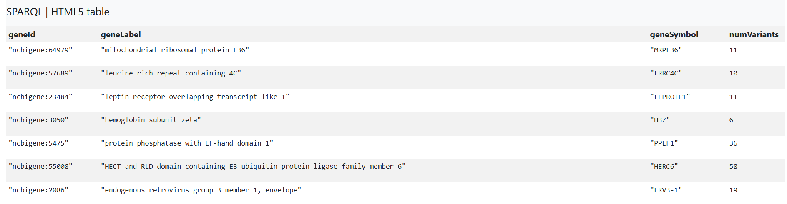
*Figure 10: Example gene fusions associated with more than one lung cancer subtype (partial view of results).*
## Lung-CABO11
Are fusion genes represented with their partner genes?
```Sparql
```
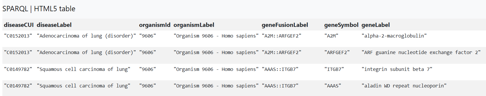
*Figure 11: Example gene fusions associated with more than one lung cancer subtype (partial view of results).*
## Lung-CABO12
Are genomic variants annotated with their chromosomal position and alleles?
```Sparql
```
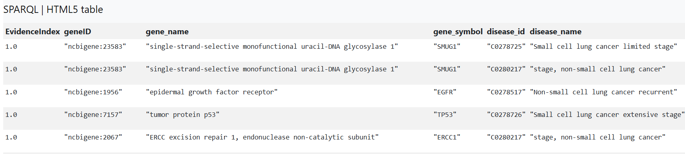
*Figure 12: Example gene fusions associated with more than one lung cancer subtype (partial view of results).*
## Lung-CABO13
What is the score or evidence index associated with a gene-disease association?
```Sparql
```

*Figure 13: Example gene fusions associated with more than one lung cancer subtype (partial view of results).*

