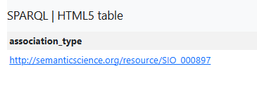

# SPARQL queries for Lung-CABO-KG competency questions

Here we include the 13 SPARQL queries for each of the competency questions designed to validate for Lung-CABO.


## Lung-CABO1
 Can we identify patterns of gene fusions that are shared across different types of pathologies?
 ```Sparql
PREFIX rdf: <http://www.w3.org/1999/02/22-rdf-syntax-ns#>
PREFIX ncit: <http://ncicb.nci.nih.gov/xml/owl/EVS/Thesaurus.owl#>
PREFIX sio: <http://semanticscience.org/resource/>
PREFIX bao: <http://www.bioassayontology.org/bao#>
PREFIX dcterms: <http://purl.org/dc/terms/>
PREFIX rdfs: <http://www.w3.org/2000/01/rdf-schema#>
PREFIX mesh: <http://phenomebrowser.net/ontologies/mesh/mesh.owl#>

SELECT ?geneFusionLabel 
       (GROUP_CONCAT(DISTINCT ?diseaseLabel; SEPARATOR=", ") AS ?associatedDiseases)
WHERE {
  # Gene-Disease Association
  ?gda sio:SIO_000628 ?gene, ?disease ;
       dcterms:identifier ?gdaId .

  # Disease information
  ?disease rdf:type ncit:C7057 ;
           dcterms:identifier ?diseaseId ;
           rdfs:label ?diseaseLabel ;
           bao:BAO_0090007 ?organismIRI .

  # Organism information
  ?organismIRI rdf:type ncit:C14250 ;
               dcterms:identifier ?organismId ;
               rdfs:label ?organismLabel .

  # Gene fusion path: GDA → biomarker → gene alteration → gene fusion
  ?biomarker rdfs:subClassOf ?gda .
  ?geneAlteration rdfs:subClassOf ?biomarker ;
                  sio:SIO_000008 ?geneFusion .

  # Gene Fusion entity
  ?geneFusion rdf:type sio:SIO_001348 ;
              dcterms:identifier ?geneFusionId ;
              rdfs:label ?geneFusionLabel .
}
GROUP BY ?geneFusionLabel
HAVING (COUNT(DISTINCT ?diseaseLabel) > 1)

 ```

*Figure 1: Example gene fusions associated with more than one lung cancer subtype (partial view of results).*


## Lung-CABO2
What level of confidence is there in the genes described in lung cancer?
```Sparql
PREFIX rdf: <http://www.w3.org/1999/02/22-rdf-syntax-ns#>
PREFIX ncit: <http://ncicb.nci.nih.gov/xml/owl/EVS/Thesaurus.owl#>
PREFIX sio: <http://semanticscience.org/resource/>
PREFIX bao: <http://www.bioassayontology.org/bao#>
PREFIX dcterms: <http://purl.org/dc/terms/>
PREFIX rdfs: <http://www.w3.org/2000/01/rdf-schema#>
PREFIX mesh: <http://phenomebrowser.net/ontologies/mesh/mesh.owl#>

SELECT DISTINCT 
  ?zscore
  ?geneID 
  ?gene_name 
  ?gene_symbol 
  ?disease_id 
  ?disease_name 
WHERE {
  # Gene-disease association
  ?gda a sio:SIO_000983 ;                          # Gene-Disease Association class
       sio:SIO_000628 ?gene, ?disease ;            # Connects to gene and disease
       sio:SIO_000216 ?zscoreIRI ;                 # Connects to Z-score resource
       dcterms:identifier ?gda_id .

  # Z-score value
  ?zscoreIRI a ncit:68741 ;                        # Z-score class
             sio:SIO_000300 ?zscore .

  # Gene information
  ?gene a ncit:C16612 ;                            # Gene class
        dcterms:identifier ?geneID ;
        rdfs:label ?gene_name ;
        sio:SIO_010078 ?proteinIRI ;               # Encodes a protein
        sio:SIO_000205 ?geneSymbolIRI .            # Has gene symbol

  # Gene symbol
  ?geneSymbolIRI a ncit:C43568 ;
                 dcterms:identifier ?gene_symbol .

  # Disease information
  ?disease rdf:type ncit:C7057 ;
           dcterms:identifier ?disease_id ;
           rdfs:label ?disease_name ;
           bao:BAO_0090007 ?organismIRI .

}

```

*Figure 2: Confidence levels of genes associated with lung cancer based on Z-score evidence (partial view of results).*
## Lung-CABO3
Can we determine the chromosomal positions of the gene variants described in lung cancer?

*Figure 3: Example gene fusions associated with more than one lung cancer subtype (partial view of results).*
## Lung-CABO4
Of the genes involved in Non-small cell lung cancer and small cell lung cancer, what pathways do they share?


*Figure 4: Example gene fusions associated with more than one lung cancer subtype (partial view of results).*
## Lung-CABO5
Which object property defines the relationship between a variant and a disease?


*Figure 5: Example gene fusions associated with more than one lung cancer subtype (partial view of results).*
## Lung-CABO6
Which semantic type is used to classify a disease in Lung-CABO throught the asociated genes?


*Figure 6: Example gene fusions associated with more than one lung cancer subtype (partial view of results).*
## Lung-CABO7
How many pathways are associated with a specific lung cancer subtype?


*Figure 7: Example gene fusions associated with more than one lung cancer subtype (partial view of results).*
## Lung-CABO8
What is the parent class and external alignment of a given disease in Lung-CABO?


*Figure 8: Example gene fusions associated with more than one lung cancer subtype (partial view of results).*
## Lung-CABO9
Which genes do not have an associated PSI?


*Figure 9: Example gene fusions associated with more than one lung cancer subtype (partial view of results).*
## Lung-CABO10
Can a given gene be associated with more than two variant?


*Figure 10: Example gene fusions associated with more than one lung cancer subtype (partial view of results).*
## Lung-CABO11
Are fusion genes represented with their partner genes?


*Figure 11: Example gene fusions associated with more than one lung cancer subtype (partial view of results).*
## Lung-CABO12
Are genomic variants annotated with their chromosomal position and alleles?


*Figure 13: Example gene fusions associated with more than one lung cancer subtype (partial view of results).*
## Lung-CABO13
What is the score or evidence index associated with a gene-disease association?

